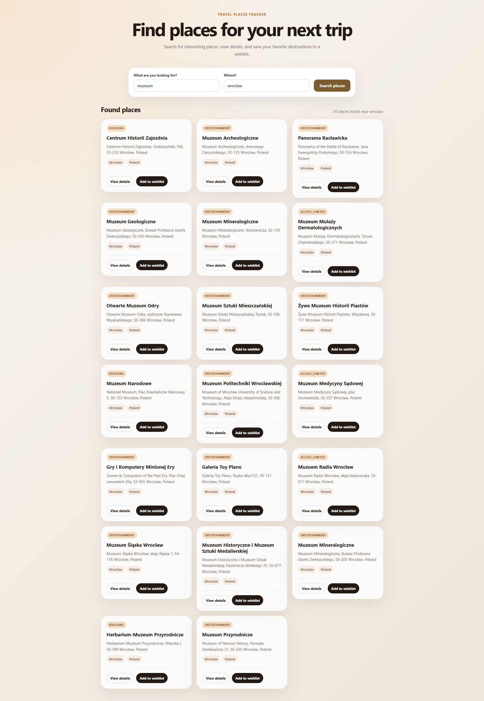
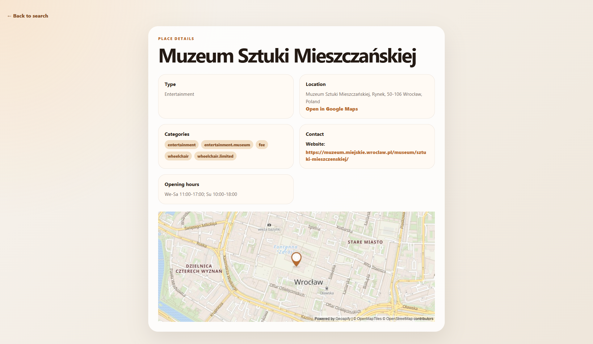
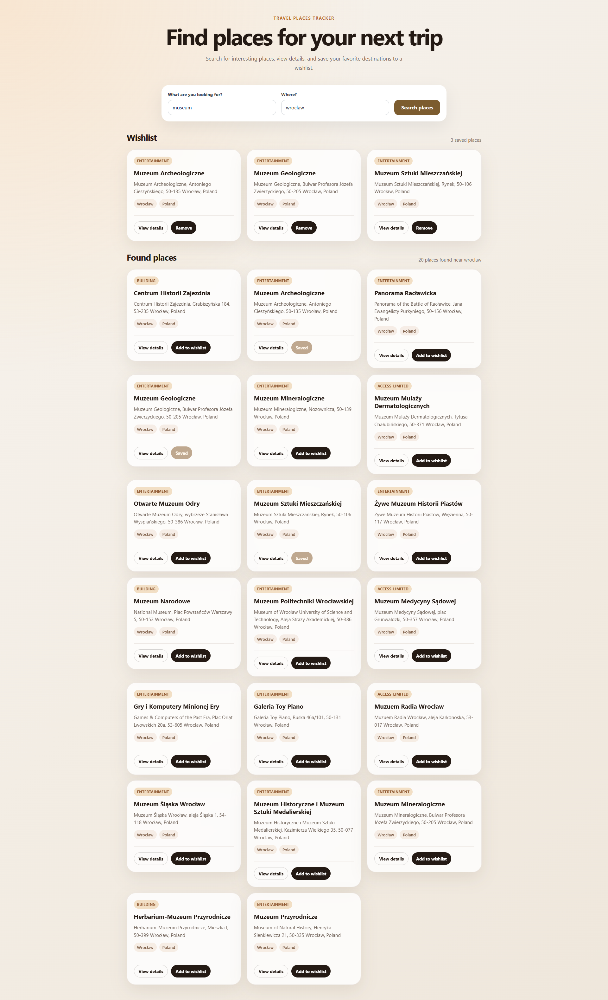

# Travel Places Tracker

Travel Places Tracker is a small Angular application for searching travel places by keyword and location, viewing place details, and saving favorite places to a wishlist.

> Note: This project requires a Geoapify API key for local usage.
> The repository contains only a placeholder API key value.
> Please follow the **Environment Setup** section before running the app.

## Test Task Description

### Travel Places Tracker

Create a web application where users can build a list of places they would like to visit based on search results by keyword and location.

The application should use any public API, for example Foursquare Places API, to fetch information about popular tourist places.

Users should be able to:

- search for places by keyword and location
- add places to a wishlist
- view details about each place, such as rating, type, photos, tips, or reviews when available
- keep saved places after page reload using localStorage

The application should also implement simple caching to avoid repeated API requests for the same search within 10 minutes.

## Preview

### Search Results



### Place Details



### Wishlist



## Features

- Search places by keyword and location
- Fetch real place data from the Geoapify API
- Display search results as responsive place cards
- View additional place details when available
- View a static map preview on the details page
- Add and remove places from wishlist
- Persist wishlist in localStorage
- Cache search results in memory for 10 minutes
- Handle loading, error, and empty states
- Display fallback values when API data is missing
- Responsive layout for desktop and mobile screens

## Tech Stack

- Angular
- TypeScript
- Angular Signals
- Reactive Forms
- Angular Router
- Angular HttpClient
- RxJS Observables
- SCSS
- Geoapify API
- localStorage
- Vitest

## API

This project uses the Geoapify API.

Geoapify is used for:

- geocoding a user-entered location
- searching places near the selected location
- loading additional place details when available
- generating a static map preview for the details page

The project is implemented as a frontend-only demo application.

## API Limitations

The original task allowed using any public places API, with Foursquare Places API mentioned as an example.

For this project, Geoapify API was used because it works reliably in a frontend-only Angular application without requiring a backend proxy.

Geoapify provides useful place information such as:

- place name
- address
- city and country
- categories
- coordinates
- place ID
- contact information when available
- opening hours when available
- additional details when available

However, Geoapify does not consistently provide ratings, reviews, real photos, tips, or rich tourist content for every place.

Because of that, the application does not fake unavailable data. Instead, it shows available information and handles missing fields with clear fallback UI.

For a production application, API requests should usually be handled through a backend or proxy layer, especially when working with private API keys or stricter API providers.

## Technical Notes

- The search form is built with Angular Reactive Forms.
- API communication is handled in a dedicated service using Angular HttpClient Observables.
- Angular Signals are used for local UI state such as loading, errors, places, and place details.
- Search results are cached in memory for 10 minutes.
- The cache key is based on both keyword and location, so different searches in the same city do not reuse incorrect results.
- Wishlist items are stored in localStorage and remain available after page reload.
- The details page displays additional place information and a static map preview when coordinates are available.
- Missing API data is handled with fallback UI.

## Environment Setup

This project uses the Geoapify API to search for places.

The repository contains only a placeholder API key value. To run the project locally, please create your own free Geoapify API key and add it to the environment file.

### How to get a Geoapify API key

1. Go to [Geoapify](https://www.geoapify.com/).
2. Create a free account or log in.
3. Open the API keys section in your Geoapify dashboard.
4. Create or copy an API key.
5. Add it to the Angular environment file.

### Edit environment file

Open this file:

```txt
src/environments/environment.ts
```

Replace `YOUR_GEOAPIFY_API_KEY` with your real Geoapify API key:

```ts
export const environment = {
  production: false,
  apiKey: 'YOUR_GEOAPIFY_API_KEY',
};
```

## Getting Started

### 1. Clone the repository

```bash
git clone https://github.com/okolomeiets/travel-places-tracker.git
cd travel-places-tracker
```

### 2. Install dependencies

```bash
npm install
```

### 3. Add Geoapify API key

Follow the **Environment Setup** section and add your Geoapify API key to:

```txt
src/environments/environment.ts
```

### 4. Run the project

```bash
npm start
```

The app will be available at:

```txt
http://localhost:4200
```

## Available Scripts

### Start development server

```bash
npm start
```

Runs the development server.

### Run tests

```bash
npm test
```

Runs unit tests.

### Build project

```bash
npm run build
```

Builds the project for production.

## Tests

The project includes unit tests for core logic and services, including:

- places API request creation
- cache saving and reading
- cache expiration after 10 minutes
- wishlist persistence in localStorage
- preventing duplicate wishlist items
- removing places from wishlist

Run tests with:

```bash
npm test
```

## Author

Created by Olha Kolomeiets.
